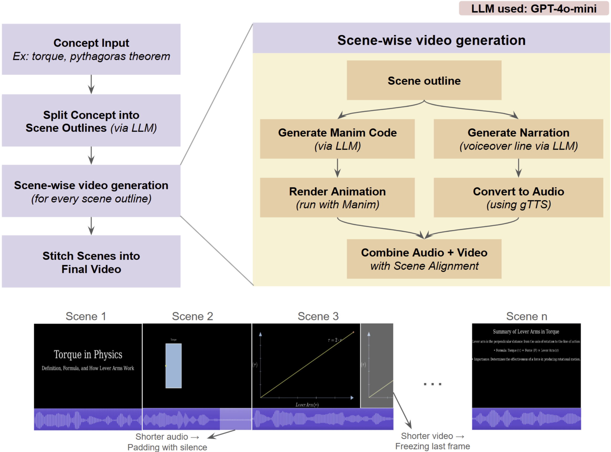
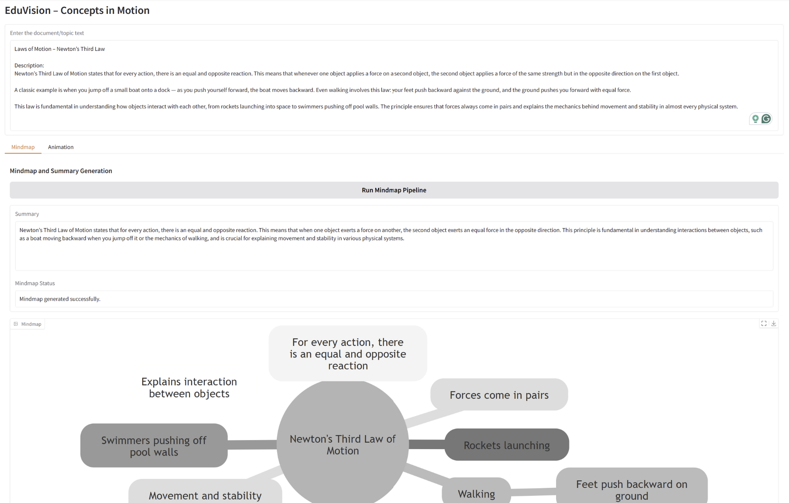
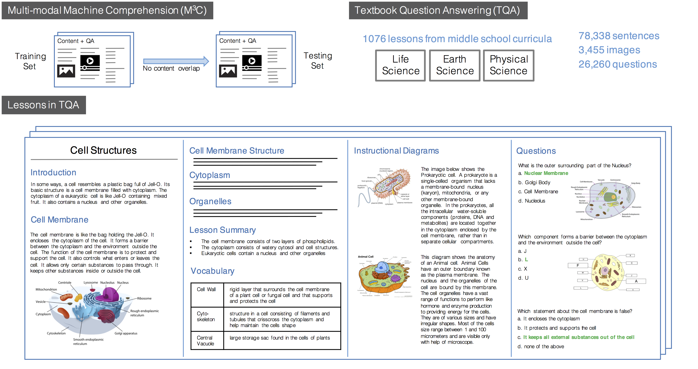
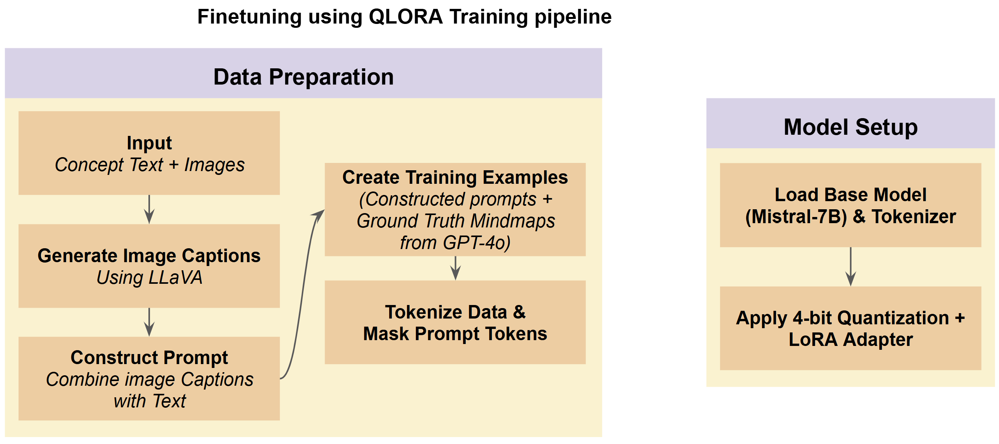
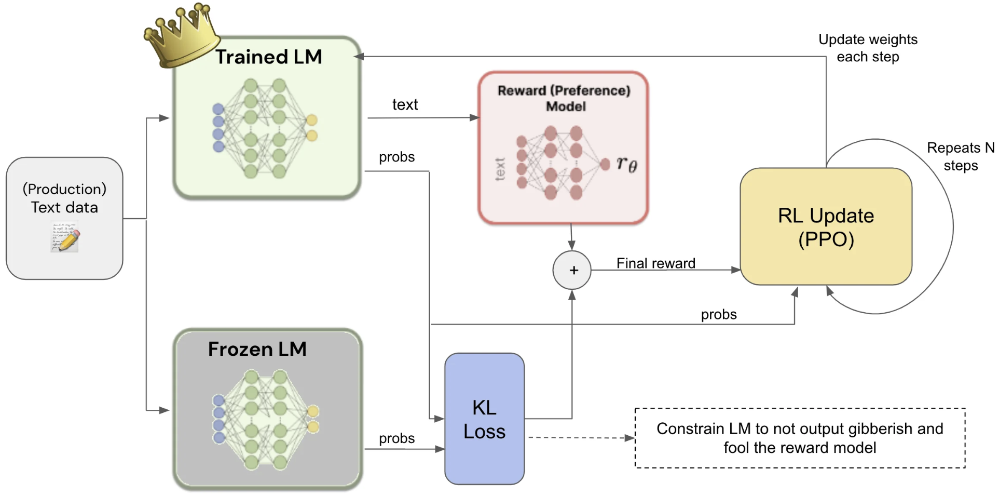
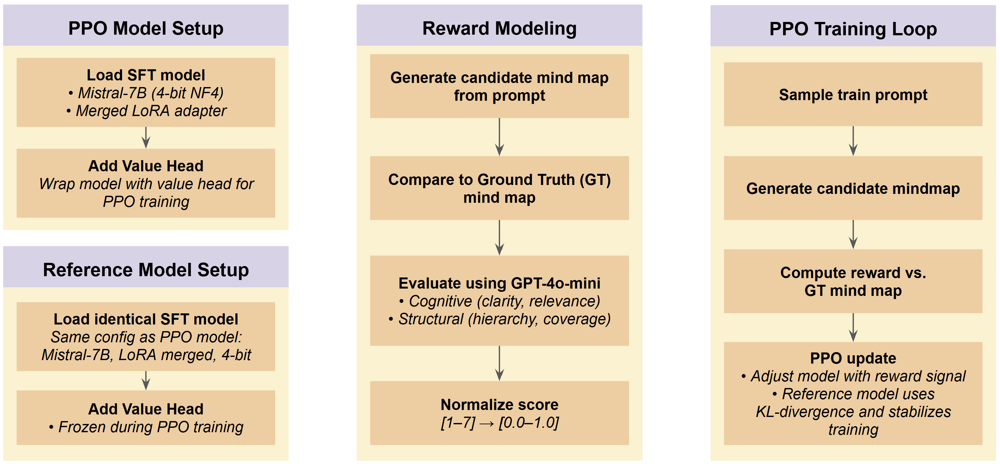
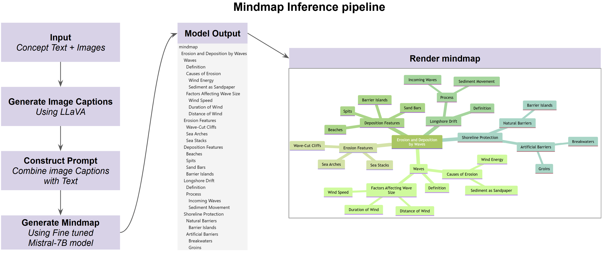

# 📚 EduVision: AI-Powered Visual Textbook Companion

**EduVision** is an intelligent learning assistant that transforms raw educational text into **interactive mindmaps** and **animated videos** to support visual learning. It leverages LLMs (like GPT-4o), Manim animations, Mermaid diagrams, and TTS to make textbook concepts engaging and accessible.

---

## ✨ Features

### **Mindmap Generation**
  - Extracts key concepts from text
  - Generates clean [Mermaid.js](https://mermaid-js.github.io/) mindmaps
  - Includes summaries and SVG rendering

### **Animated Video Pipeline**
  - Converts topics into step-wise Manim animations
  - Uses LLMs to write and debug Manim code
  - Auto-generates narration and syncs it with video
  - Supports final video concatenation

<div style="text-align: center;">
  
</div>

### **Web UI with Gradio**
  - Text input → mindmap + summary
  - Text input → animated explainer video
  - Easily launchable interactive interface

<div style="text-align: center;">
  
</div>

---

## Mindmap Training Pipeline

EduVision’s mindmap generator is backed by a supervised + RLHF training workflow:

### **Dataset (TQA)**  
   - **666 training samples** and **200 test samples** from the Textbook Question Answering corpus.

<div style="text-align: center;">
  
</div>

### **Preprocessing**  
   - **Image Captioning**: Use LLAVA to convert textbook figures into detailed captions.  
   - **Multimodal Fusion**: Combine captions with the original text for richer context.

<div style="text-align: center;">
  
</div>

### **Supervised Fine‑Tuning**  
   - Base model: **Mistral-7B-Instruct-v0.3** (4‑bit quantized).  
   - Adapter: **qLoRA** applied to learn Mermaid‑UML mindmap structure.  
   - Input: Text + captions → Output: Mermaid UML list with exactly one root node.

### **Reinforcement Learning with Human Feedback (RLHF)**  

<div style="text-align: center;">
  
</div>

   - **PPO** applied to the qLoRA‑tuned model.  
   - **Simulated feedback**: GPT‑4o‑mini generates two candidates; selects the better as ground truth.  
   - **Reward Model**: GPT‑4o‑mini scores candidates on Cognitive Quality and Structural Integrity; normalized to [0,1].  
   - **Training loop**: At each step, the policy generates a mindmap, reward is computed, and PPO updates the LoRA adapter under a KL penalty against a frozen reference.

<div style="text-align: center;">
  
</div>

### **Inference**  
   - Instruction‑style prompt ensures minimal, valid Mermaid syntax with one central node.  
   - Entire pipeline—from raw text to final Mermaid list—is fully automated in `src/mindmap.py`.

<div style="text-align: center;">
  
</div>

---
## 🔧 Install Dependencies

Install Python packages:

```bash
pip install -r requirements.txt
```

### **Mindmap visualization setup instruction**

```
curl -o- https://raw.githubusercontent.com/nvm-sh/nvm/v0.39.5/install.sh | bash
source ~/.nvm/nvm.sh
nvm install 18
nvm use 18
node -v
npm install -g @mermaid-js/mermaid-cli
mmdc -V
```
### **Manim and animation setup instruction**

```
sudo apt update
sudo apt install build-essential
```

```
sudo apt install pkg-config cmake libcairo2-dev
sudo apt install libpango1.0-dev
sudo apt install ffmpeg
sudo apt install texlive texlive-latex-extra
```


## 🧠 Architecture Overview

```
📦 EduVision
├── src/
│   ├── app.py                # Gradio app (UI logic)
│   ├── animation_gen.py      # Manim + narration + TTS pipeline
│   ├── llm_loader.py         # Loads OpenAI keys and LLM
│   ├── mindmap.py            # Mindmap generation via Mermaid
│   └── summary.py            # Text summarization
├── data/                     # Training/eval data (selectively included)
├── notebooks/                # Dev notebooks
├── models/                   # Optional model exports
├── requirements.txt
└── README.md
```

---

## 🧪 Example Use Cases

- Teachers can animate chapters and create narrated explainers
- Students can visualize relationships between concepts
- EdTech platforms can integrate auto-summary and mindmapping

---

## 🧭 Usage Instructions

### 🔑 API Key Setup

Create a `keys.json` file at the root directory:

```json
{
  "openai_api_key": "your_openai_api_key_here",
  "huggingface_access_token": "your_huggingface_access_token_here"
}
```

### ▶️ Run the App

From the project directory:

```bash
python src/app.py
```

Then open the Gradio interface in your browser and start exploring!

---

## 📂 Output Structure

Generated media and intermediate outputs go to:

```
outputs/
├── animation_outline.yaml
├── audio/
├── final/
├── temp/
└── videos/
```

---

## 🧰 Tools Used

- [LangChain](https://github.com/hwchase17/langchain) – LLM interface
- [Manim](https://www.manim.community/) – 2D math animation engine
- [gTTS](https://pypi.org/project/gTTS/) – Google Text-to-Speech
- [Gradio](https://www.gradio.app/) – Interactive web app
- [Mermaid.js](https://mermaid-js.github.io/) – Diagram rendering

---


